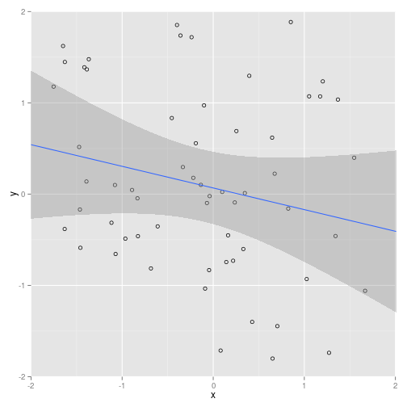

Standard Deviation Explorer
========================================================
author: Robin Chauhan
date: Aug 23, 2015
transition: rotate

Stats profs
========================================================
 - Do your students have trouble understanding the impact of SD on regression and confidence intervals?
 - We have built the ultimate solution 
 - Hundreds of man-years have gone into this groundbreaking system
 - Stats 101 will never be the same again
 - Use it here: https://rrsch.shinyapps.io/project_shiny_app

Core Algorithm
========================================================


```r
x_std_dev <- 1.0
y_std_dev <- 2.0
obs<-100
x <- rnorm(obs, sd=x_std_dev)
y <- rnorm(obs, sd=y_std_dev)
dat<-data.frame(x,y)
lm(dat$y~dat$x)
```

```

Call:
lm(formula = dat$y ~ dat$x)

Coefficients:
(Intercept)        dat$x  
    -0.1620       0.2334  
```

Example Plot
========================================================
 - Note regression line and confidence interval
 


Next Steps
========================================================
- Fall 2015: International patent application core technology
- Aggresively hiring PhDs and ex-SpaceX engineers
- IPO in early 2016
- Producing 2-hour CGI tutorial at DreamWorks
- Join us and change the World! (of Stats 101 education)
